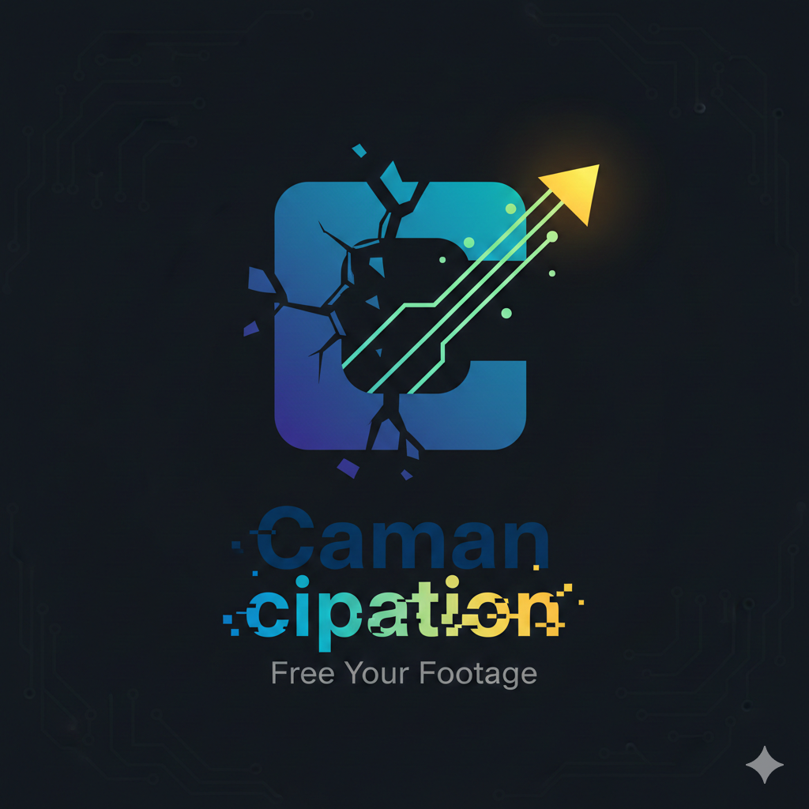

# Camancipation 🔓



**Camancipation** is a minimalist recovery tool for freeing legacy TechSmith Camtasia (`.trec`) recordings. Designed for Mac power users who prefer `vi` over GUIs and `ffmpeg` over bloat.

## The Problem
Old `.trec` files are proprietary black boxes. If your software version doesn't match, or the file index is "incomplete," your footage is effectively held hostage.

## The Solution
Camancipation uses your `project.xml` as a surgical map to carve out segments from raw media streams and restitch them into a modern, open-standard MP4—complete with Picture-in-Picture webcam overlays.

---

## 🛠 Prerequisites

- **Python 3.x**
- [**FFmpeg**](https://www.ffmpeg.org) (with `h264_videotoolbox` support)
- [**LosslessCut**](https://github.com/mifi/lossless-cut) (for initial stream extraction)

For Apple Silicon it will utilize hardware acceleration.

## 🚀 Workflow

### 1. Extraction
Open your `.trec` file in **LosslessCut**. Extract the following streams:
- `extracted_screen.mkv` (The primary screen recording)  `stream-0`, might be a `.mkv` file
- `extracted_webcam.mp4` (The webcam inset), `stream-1`, might be a `.mp4` file
- `extracted_audio.wav` (The master audio), `stream-2`, might be a `.aac` file

### 2. The Map
Locate the `project.xml` file within your Camtasia project folder.

### 3. Execution
Run the provided Python script to parse the XML and automate the `ffmpeg` filtergraph:

```bash
python3 camancipation.py
```

For now, you need to edit the file to set the filenames.

## 🧠 How Segment Selection Works

Camtasia's `project.xml` contains a timeline that describes what parts of the original recording are used in the final output. The key elements are:

- **`ScreenVMFile`**: Direct clips placed on the timeline
- **`StitchedMedia`**: Containers that group multiple clips together (usually created when editing with cuts)

### The Algorithm

1. **Parse the top-level timeline**: We scan the main `<GenericTrack>` for media elements that represent the final video structure.

2. **Extract segment metadata**: Each top-level element (ScreenVMFile or StitchedMedia) has:
   - `mediaStart`: Where in the original source media this segment begins (in frames)
   - `mediaDuration`: How long this segment plays (in frames)

3. **Key insight**: `StitchedMedia` containers already describe the final composite segments. Their internal nested structure shows how they were composed during editing, but we use the container's aggregate values, not the individual pieces.

4. **Build the segment list**: We create an ordered list of segments, each specifying where to pull from the original media and how much to extract.

5. **Concatenate**: These segments, extracted in order, form the final edited video when joined together.

### Example

If the original recording is 18 minutes but contains 5 minutes of bad takes that were cut:
- The `project.xml` might describe 6 segments
- Each segment references different frame ranges from the source
- When extracted and concatenated, they produce the ~13-minute edited video

## ⚖️ License

This project is licensed under the **MIT License** - see the [LICENSE](LICENSE) file for details. 

*Camancipation* is provided "as is" in the spirit of open-source data recovery. It is not affiliated with, or endorsed by, TechSmith Corporation.